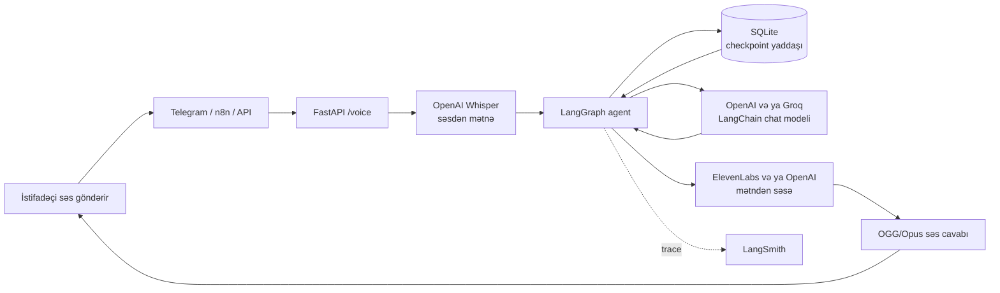
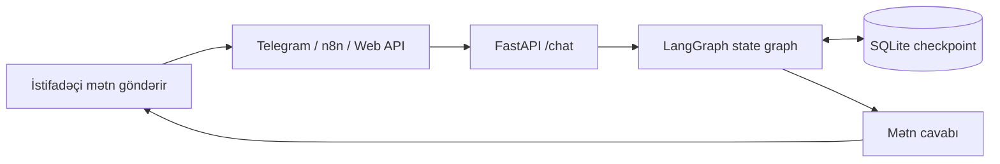
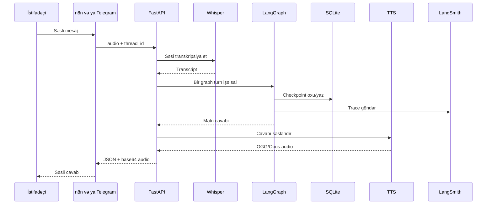
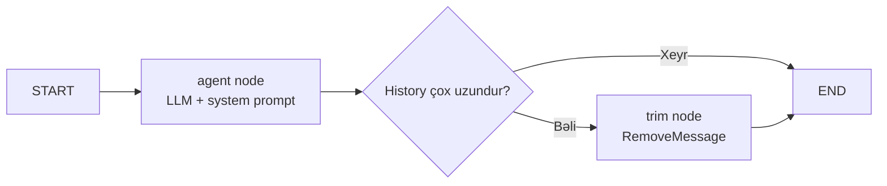

# Voice AI Agent

> Dinləyən, anlayan, yadda saxlayan və cavab verən səsli AI köməkçi.

Bu layihə dərsdə keçilən AI mühəndisliyi texnologiyalarını bir sistemdə
birləşdirir. **FastAPI və LangGraph AI beynidir; n8n isə vizual inteqrasiya və
avtomatlaşdırma qatıdır.**

## 1. Ümumi arxitektura

### Səsli söhbət



### Mətn söhbəti



## 2. Dərs texnologiyaları bu layihədə harada tətbiq olunur?

| Dərs mövzusu | Layihədəki texnologiya | Məqsədi | Kod keçidi |
|---|---|---|---|
| Voice AI | OpenAI Whisper | Səsi mətnə çevirir | [`voice.py`](apps/voice-ai-agent/app/services/voice.py) |
| Voice AI | ElevenLabs / OpenAI TTS | Cavabı OGG/Opus səsinə çevirir | [`voice.py`](apps/voice-ai-agent/app/services/voice.py) |
| LLM tətbiqləri | OpenAI `gpt-4.1-mini` | Söhbət cavabını yaradır; Groq alternativdir | [`llm.py`](apps/voice-ai-agent/app/services/llm.py) |
| LangGraph | State graph, node və conditional edge | Agentin icra məntiqini idarə edir | [`builder.py`](apps/voice-ai-agent/app/graph/builder.py) |
| Memory | SQLite checkpoint saver | `thread_id` üzrə söhbəti saxlayır | [`sqlite.py`](apps/voice-ai-agent/app/memory/sqlite.py) |
| LangSmith | LangChain tracing | Model və graph icralarını izləyir | [`config.py`](apps/voice-ai-agent/app/core/config.py) |
| API | FastAPI | `/chat`, `/voice` və health endpoint-lərini verir | [`main.py`](apps/voice-ai-agent/app/main.py) |
| Automation | n8n | Kanal və biznes workflow-larını vizual bağlayır | [`n8n/workflows/`](n8n/workflows/) |
| Deployment | Docker Compose | API, Telegram və n8n servislərini işlədir | [`docker-compose.yml`](docker-compose.yml) |

Əsas arxitektura qərarı budur: n8n LangGraph agentini təkrarlamır. n8n yalnız
giriş, inteqrasiya və avtomatlaşdırmanı idarə edir; yaddaş, prompt, model seçimi,
səs emalı və tracing backend-də bir yerdə qalır.

## 3. Səsli mesajın sistemdə hərəkəti



## 4. n8n workflow-ları

Bu workflow-lar üç ayrı agent deyil, eyni backend agentinə qoşulan giriş
adapterləridir.

### Mətn webhook-u

```text
Webhook JSON -> HTTP Request /chat -> Respond to Webhook
```

[`voice-ai-agent-chat.json`](n8n/workflows/voice-ai-agent-chat.json)

### Ümumi səs webhook-u

```text
Webhook multipart audio -> HTTP Request /voice -> Respond to Webhook
```

[`voice-ai-agent-voice.json`](n8n/workflows/voice-ai-agent-voice.json)

### Telegram səs round-trip workflow-u

```text
Telegram Trigger
    -> Is Voice Message
    -> HTTP Request /voice
    -> Base64 cavabı binary audio-ya çevir
    -> Telegram Send Voice
```

[`voice-ai-agent-telegram.json`](n8n/workflows/voice-ai-agent-telegram.json)

Ətraflı n8n qurulumu: [`n8n/README.md`](n8n/README.md).

Eyni bot tokeni ilə eyni vaxtda yalnız bir Telegram update consumer işləməlidir:
n8n Telegram Trigger **və ya** standalone [`bot.py`](apps/voice-ai-agent/bot.py).

## 5. LangGraph agenti



- `ChatState.messages` mesajları `add_messages` reducer-i ilə toplayır.
- `thread_id` konkret söhbətin checkpoint yaddaşını seçir.
- Graph fake model ilə provider çağırmadan test edilə bilir.

İmplementasiya: [`builder.py`](apps/voice-ai-agent/app/graph/builder.py)

## 6. LangSmith tracing

LangSmith məcburi deyil, lakin dərs təqdimatı və debugging üçün faydalıdır.
Aktiv olduqda LangChain model çağırışlarını və graph icralarını trace edir.

`.env` faylında:

```dotenv
LANGSMITH_API_KEY=your-key
LANGSMITH_TRACING=true
LANGSMITH_PROJECT=voice-ai-agent
LANGSMITH_ENDPOINT=https://api.smith.langchain.com
```

Sonra [smith.langchain.com](https://smith.langchain.com/) üzərindən
`voice-ai-agent` layihəsini açın və Telegram/API sorğusunun run tree-sinə baxın.

Qeyd: LangSmith Studio öz mühitində işləyirsə, lokal `.env` faylını avtomatik
oxumaya bilər. Studio mühitinə ayrıca `OPENAI_API_KEY` secret əlavə edilməlidir.
Lokal API tracing-i üçün isə bu layihənin `.env` faylı kifayətdir.

Konfiqurasiya: [`config.py`](apps/voice-ai-agent/app/core/config.py)

### Trace-lərdə hansı məlumatlar görünməlidir?

Hər LangGraph turn-ı təhlükəsiz metadata ilə işarələnir. Telegram botu və n8n
backend-ə kanal header-i göndərir:

```text
channel: api / telegram / n8n
modality: text / voice
llm_provider: openai / groq
llm_model: gpt-4.1-mini / ...
environment: local / staging / production
app_version: git commit və ya deployment versiyası
thread_id_hash: anonimləşdirilmiş söhbət identifikatoru
```

Bu metadata qırmızı trace-in səbəbini ayırmağa kömək edir: problem text və ya
voice axınındadır, hansı provider/model istifadə olunub və hansı versiyada baş
verib. Raw `thread_id` və API key-lər trace metadata-sına yazılmır.

## 7. Lokal layihəni işə salmaq

### Hazırkı lokal portlar

Bu workspace-də `docker compose ps` ilə təsdiqlənmiş ünvanlar:

| Servis | Lokal ünvan | Container portu |
|---|---:|---:|
| FastAPI API | `http://127.0.0.1:8011` | `8000` |
| n8n editor | `http://127.0.0.1:5679` | `5678` |

Portlar dəyişə bilər. Həmişə yoxlayın:

```bash
docker compose ps
```

API host portu `API_PORT`, n8n host portu `N8N_HOST_PORT` ilə idarə olunur.
Docker daxilində n8n və Telegram servisinin backend ünvanı
`http://api:8000` olaraq qalır; host portu ilə əvəz edilməməlidir.

### Konfiqurasiya

```bash
cp .env.example .env
```

Cari lokal seçim:

```dotenv
LLM_PROVIDER=openai
OPENAI_API_KEY=...
```

Groq alternativi üçün `LLM_PROVIDER=groq` və `GROQ_API_KEY` istifadə edin.
Voice input üçün Whisper səbəbilə `OPENAI_API_KEY` tələb olunur.

### Docker servisleri

```bash
docker compose --profile telegram up --build
docker compose --profile n8n up --build
docker compose --profile telegram --profile n8n up --build
```

Lokal keçidlər:

- [FastAPI docs](http://127.0.0.1:8011/docs)
- [Health endpoint](http://127.0.0.1:8011/)
- [n8n editor](http://127.0.0.1:5679)

### Standalone Telegram bot

Docker-dan kənarda işləyən bot üçün `apps/voice-ai-agent/.env` daxilində:

```dotenv
BACKEND_URL=http://127.0.0.1:8011
```

Sonra:

```bash
cd apps/voice-ai-agent
.venv/bin/python bot.py
```

## 8. Birbaşa API testləri

### Mətn

```bash
curl -X POST http://127.0.0.1:8011/chat \
  -H "Content-Type: application/json" \
  -d '{"thread_id":"demo","message":"Salam"}'
```

### Səs

```bash
curl -X POST http://127.0.0.1:8011/voice \
  -F 'file=@voice.ogg;type=audio/ogg' \
  -F 'thread_id=voice-demo'
```

Voice cavabında `transcript`, `reply`, `audio_base64`, `audio_mime`,
`tts_provider` və `history_length` sahələri olur.

## 9. Kod xəritəsi

| Sahə | Fayl |
|---|---|
| FastAPI tətbiqi və lifespan | [`main.py`](apps/voice-ai-agent/app/main.py) |
| Mətn endpoint-i | [`chat.py`](apps/voice-ai-agent/app/api/chat.py) |
| Səs endpoint-i | [`voice.py`](apps/voice-ai-agent/app/api/voice.py) |
| Agent graph | [`builder.py`](apps/voice-ai-agent/app/graph/builder.py) |
| Model provider seçimi | [`llm.py`](apps/voice-ai-agent/app/services/llm.py) |
| Whisper və TTS | [`voice.py`](apps/voice-ai-agent/app/services/voice.py) |
| SQLite memory | [`sqlite.py`](apps/voice-ai-agent/app/memory/sqlite.py) |
| System prompt | [`system_prompt.py`](apps/voice-ai-agent/app/prompts/system_prompt.py) |
| Settings və LangSmith | [`config.py`](apps/voice-ai-agent/app/core/config.py) |
| Telegram adapteri | [`bot.py`](apps/voice-ai-agent/bot.py) |
| Testlər | [`tests/`](apps/voice-ai-agent/tests/) |

## 10. Yoxlama

```bash
cd apps/voice-ai-agent
.venv/bin/pytest -q
```

Graph testi eyni `thread_id` ilə iki turn arasında yaddaşın qorunduğunu
göstərir: [`test_graph.py`](apps/voice-ai-agent/tests/test_graph.py).

Offline golden evaluation-ı provider çağırmadan işlətmək üçün:

```bash
cd apps/voice-ai-agent
.venv/bin/python -m app.evals.run
```

Dataset: [`golden.json`](apps/voice-ai-agent/app/evals/golden.json). Bu suite cavab
formatı, qısa və Azərbaycan dilində cavab, memory tarixçəsi və voice audio
payload contract-ını yoxlayır. Canlı LLM keyfiyyəti isə eyni case ID-lər ilə
LangSmith evaluator mərhələsində ölçülməlidir.

CI-də həm pytest, həm də bu offline golden suite işləyir. Beləliklə response
contract və əvvəl düzəldilmiş məlum regressiyalar hər push-da yoxlanılır.

Layihənin əsas axını:

```text
səs/mətn -> Whisper (yalnız səs) -> LangGraph -> SQLite memory
         -> LLM cavabı -> TTS (yalnız səs) -> mətn/səs cavabı
```
