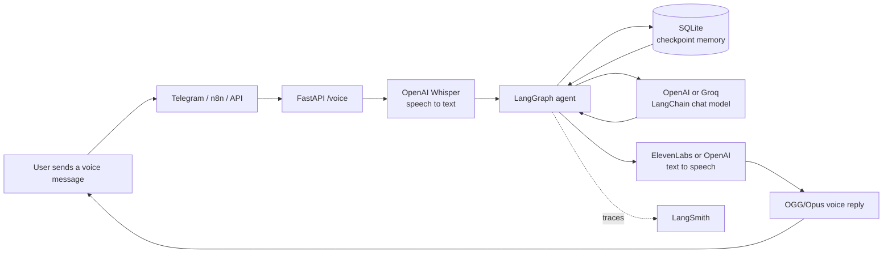
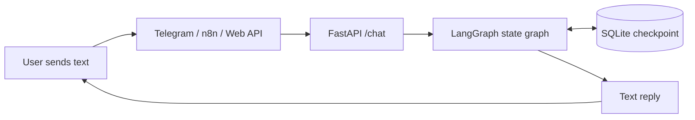
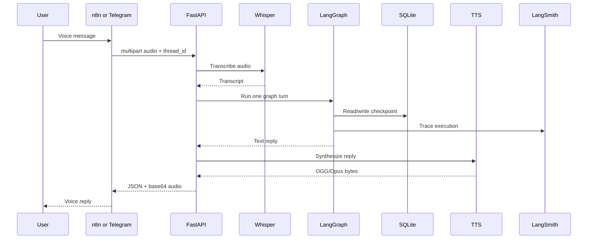
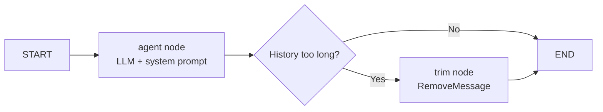

# Voice AI Agent

> A voice-first AI assistant that listens, understands, remembers, and replies.

This project demonstrates how the AI engineering lessons fit together in one
production-shaped application. **FastAPI and LangGraph contain the AI brain;
n8n contains the visual integration and automation layer.**

## 1. The complete architecture

### Voice conversation



### Text conversation



## 2. Which lesson technology is used where?

| Lesson topic | Technology in this project | Role | Open the implementation |
|---|---|---|---|
| Voice AI | OpenAI Whisper | Converts incoming audio to text | [`app/services/voice.py`](apps/voice-ai-agent/app/services/voice.py) |
| Voice AI | ElevenLabs / OpenAI TTS | Converts the agent reply to OGG/Opus audio | [`app/services/voice.py`](apps/voice-ai-agent/app/services/voice.py) |
| LLM applications | OpenAI (`gpt-4.1-mini`) | Generates the conversational answer; Groq remains an optional fallback | [`app/services/llm.py`](apps/voice-ai-agent/app/services/llm.py) |
| LangGraph | State graph, nodes, conditional edges | Defines the agent execution flow | [`app/graph/builder.py`](apps/voice-ai-agent/app/graph/builder.py) |
| Memory | SQLite checkpoint saver | Persists conversation state by `thread_id` | [`app/memory/sqlite.py`](apps/voice-ai-agent/app/memory/sqlite.py) |
| LangSmith | LangChain tracing | Observes model calls and graph executions | [`app/core/config.py`](apps/voice-ai-agent/app/core/config.py) |
| APIs | FastAPI | Exposes stable `/chat`, `/voice`, and health endpoints | [`app/main.py`](apps/voice-ai-agent/app/main.py) |
| Automation | n8n | Connects channels and business workflows visually | [`n8n/workflows/`](n8n/workflows/) |
| Deployment | Docker Compose | Runs API, Telegram, and n8n services together | [`docker-compose.yml`](docker-compose.yml) |

The important design decision is that n8n does **not** duplicate the LangGraph
agent. It calls the backend as an integration layer. This keeps memory,
prompting, model selection, voice processing, and tracing in one tested place.

## 3. How one voice message moves through the system



## 4. n8n workflows

There are three visual workflows. They are different **entry adapters**, not
three different AI agents:

### A. Text webhook

```text
Webhook JSON -> HTTP Request /chat -> Respond to Webhook
```

Open: [`voice-ai-agent-chat.json`](n8n/workflows/voice-ai-agent-chat.json)

### B. Generic voice webhook

```text
Webhook multipart audio -> HTTP Request /voice -> Respond to Webhook
```

Open: [`voice-ai-agent-voice.json`](n8n/workflows/voice-ai-agent-voice.json)

### C. Telegram voice round trip

```text
Telegram Trigger
    -> Is Voice Message
    -> HTTP Request /voice
    -> Decode base64 audio to binary
    -> Telegram Send Voice
```

Open: [`voice-ai-agent-telegram.json`](n8n/workflows/voice-ai-agent-telegram.json)

The n8n-specific setup guide is available in
[`n8n/README.md`](n8n/README.md). Use one Telegram update consumer at a time:
either the n8n Telegram workflow or the standalone [`bot.py`](apps/voice-ai-agent/bot.py)
polling bot. Running both with the same bot token causes update conflicts.

## 5. LangGraph: the agent brain

The graph is intentionally small and visible:



- `ChatState.messages` is accumulated with the `add_messages` reducer.
- `thread_id` selects the conversation checkpoint.
- The graph can be tested with a fake model without calling a provider.

Open the implementation: [`app/graph/builder.py`](apps/voice-ai-agent/app/graph/builder.py)

## 6. LangSmith observability

LangSmith is optional but recommended for a lesson presentation and debugging.
When enabled, LangChain automatically traces the graph and model calls.

1. Create a project at [smith.langchain.com](https://smith.langchain.com/).
2. Add these values to `.env`:

   ```dotenv
   LANGSMITH_API_KEY=your-key
   LANGSMITH_TRACING=true
   LANGSMITH_PROJECT=voice-ai-agent
   LANGSMITH_ENDPOINT=https://api.smith.langchain.com
   ```

3. Start the API and open the project in LangSmith.
4. Send a text or voice message and inspect the run tree.

The application publishes the settings to the environment at startup:
[`app/core/config.py`](apps/voice-ai-agent/app/core/config.py).

## 7. Run the local project correctly

### Ports in this workspace

The currently running local containers were verified with `docker compose ps`:

| Service | Current local address | Container port |
|---|---:|---:|
| FastAPI API | `http://127.0.0.1:8011` | `8000` |
| n8n editor | `http://127.0.0.1:5679` | `5678` |

These host ports are overrides for this local workspace. Compose defaults are
`8000` for the API and `5678` for n8n, but do not assume the defaults when the
containers are already running. Always confirm with:

```bash
docker compose ps
```

The host API port is controlled by `API_PORT`; the n8n host port is controlled
by `N8N_HOST_PORT`. The n8n HTTP nodes use `BACKEND_URL=http://api:8000`
inside the Docker network, so they do not use the host API port.

In the current local n8n storage, the imported workflows were verified as
**inactive**:

- `Voice AI Agent Chat Webhook`
- `Voice AI Agent Voice Webhook`

Importing a workflow does not make it live automatically. Open each workflow in
the n8n editor and activate it before testing its production webhook. The
Telegram workflow JSON exists in the repository but must also be imported
manually when the n8n storage already contains workflows; see
[`n8n/README.md`](n8n/README.md).

### Configuration

```bash
cp .env.example .env
```

The current local configuration uses OpenAI for the conversational model:

```dotenv
LLM_PROVIDER=openai
OPENAI_API_KEY=...
```

Groq is still supported if you explicitly set `LLM_PROVIDER=groq` and provide
`GROQ_API_KEY`. For voice input, `OPENAI_API_KEY` is required because Whisper
is used for STT.
For Telegram, add `TELEGRAM_BOT_TOKEN`.

### API + Telegram bot (Docker)

```bash
docker compose --profile telegram up --build
```

Inside Docker, the Telegram service calls the API as `http://api:8000`. Do not
change that to the host port.

### API + n8n

```bash
docker compose --profile n8n up --build
```

### All services

```bash
docker compose --profile telegram --profile n8n up --build
```

Local interfaces:

- FastAPI docs (current workspace): [http://127.0.0.1:8011/docs](http://127.0.0.1:8011/docs)
- Health endpoint (current workspace): [http://127.0.0.1:8011/](http://127.0.0.1:8011/)
- n8n editor (current workspace): [http://127.0.0.1:5679](http://127.0.0.1:5679)

If `docker compose ps` shows different host ports, use those values instead.

### Standalone Telegram bot (local Python process)

The standalone [`bot.py`](apps/voice-ai-agent/bot.py) is a separate Telegram
update consumer. It calls the API through `BACKEND_URL` from `.env`, so that
value must match the actual host API port when the bot runs outside Docker:

```dotenv
BACKEND_URL=http://127.0.0.1:8011
```

Run it from the backend directory:

```bash
cd apps/voice-ai-agent
.venv/bin/python bot.py
```

Do not run this polling bot at the same time as the n8n Telegram Trigger with
the same bot token. Telegram permits one update consumer per bot.

## 8. Direct API examples

### Text

```bash
curl -X POST http://127.0.0.1:8011/chat \
  -H "Content-Type: application/json" \
  -d '{"thread_id":"demo","message":"Hello"}'
```

### Voice

```bash
curl -X POST http://127.0.0.1:8011/voice \
  -F 'file=@voice.ogg;type=audio/ogg' \
  -F 'thread_id=voice-demo'
```

The voice response contains `transcript`, `reply`, `audio_base64`,
`audio_mime`, `tts_provider`, and `history_length`.

## 9. Code map

| Area | File |
|---|---|
| FastAPI application and lifespan | [`app/main.py`](apps/voice-ai-agent/app/main.py) |
| Text endpoint | [`app/api/chat.py`](apps/voice-ai-agent/app/api/chat.py) |
| Voice endpoint | [`app/api/voice.py`](apps/voice-ai-agent/app/api/voice.py) |
| Agent graph | [`app/graph/builder.py`](apps/voice-ai-agent/app/graph/builder.py) |
| Model provider selection | [`app/services/llm.py`](apps/voice-ai-agent/app/services/llm.py) |
| Whisper and TTS | [`app/services/voice.py`](apps/voice-ai-agent/app/services/voice.py) |
| SQLite memory | [`app/memory/sqlite.py`](apps/voice-ai-agent/app/memory/sqlite.py) |
| Prompt | [`app/prompts/system_prompt.py`](apps/voice-ai-agent/app/prompts/system_prompt.py) |
| Settings and LangSmith | [`app/core/config.py`](apps/voice-ai-agent/app/core/config.py) |
| Telegram standalone adapter | [`bot.py`](apps/voice-ai-agent/bot.py) |
| Automated tests | [`tests/`](apps/voice-ai-agent/tests/) |

## 10. Validation

Run the application tests from the backend directory:

```bash
cd apps/voice-ai-agent
.venv/bin/pytest -q
```

The graph test demonstrates that two turns with the same `thread_id` share
memory: [`tests/test_graph.py`](apps/voice-ai-agent/tests/test_graph.py).

The local runtime was also smoke-tested:

- `GET /` returned `{"status":"ok"}` on port `8011`.
- `POST /chat` returned a live LLM reply.
- `POST /voice` transcribed a generated audio sample and returned OGG audio.
- Telegram `getMe` succeeded and the bot started polling against
  `http://127.0.0.1:8011`.

## Project status

The core path is complete:

```text
voice/text -> transcription (voice only) -> LangGraph -> SQLite memory
          -> LLM reply -> TTS (voice only) -> text/voice response
```

The architecture is intentionally split at the right boundary:

- **AI engineering code:** FastAPI, LangGraph, LangChain, Whisper, TTS, SQLite,
  and LangSmith.
- **Visual automation:** n8n triggers, HTTP calls, binary conversion, and
  Telegram/business-system actions.
