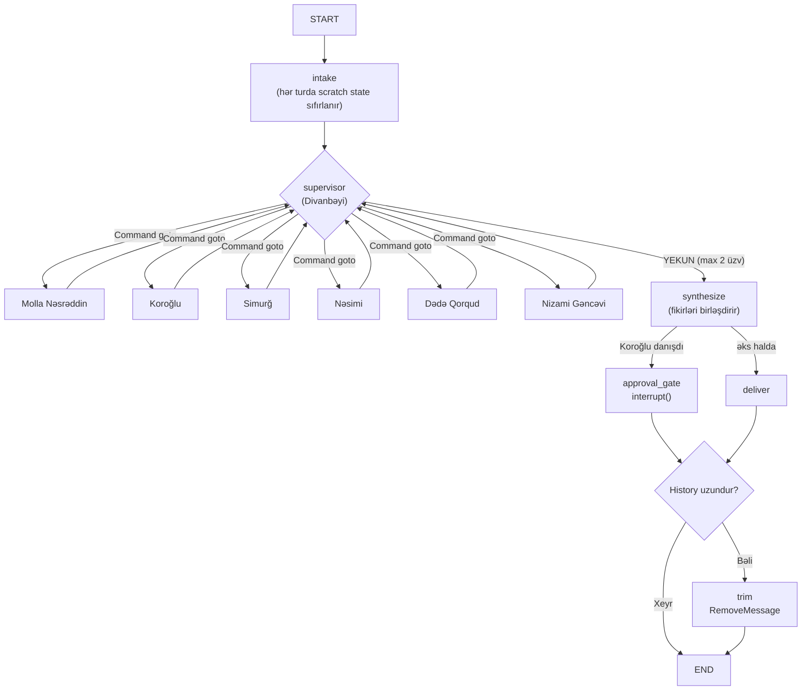
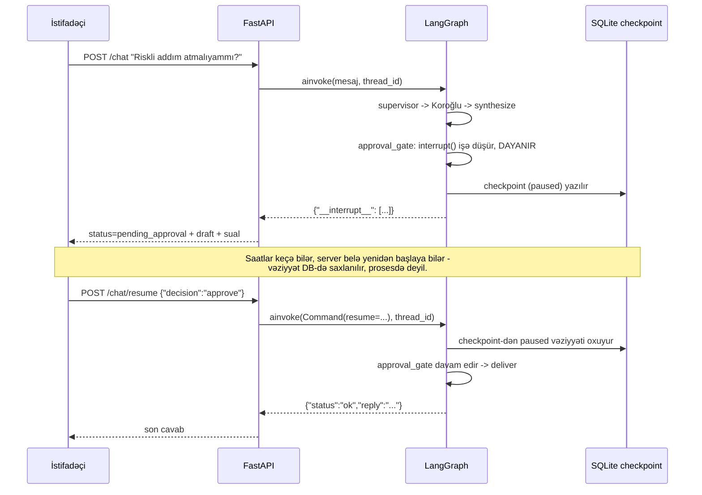
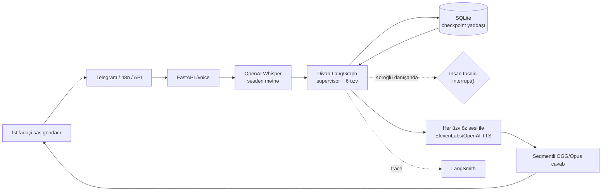
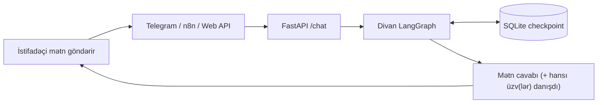

# Divan — Əfsanələr Şurası

> Səslə soruş, Azərbaycan tarixinin altı əfsanəvi simasından cavab al.

Bu layihə dərsdə keçilən AI mühəndisliyi texnologiyalarını (LangGraph
multi-agent, Human-in-the-Loop, səsli AI, tracing) real, işlək bir məhsulda
birləşdirir: **Divan** — istifadəçinin sualına ən uyğun tarixi/ədəbi
şəxsiyyət(lər)i çağıran, öz xarakterinə uyğun cavab verən və riskli
tövsiyələrdə insan təsdiqi gözləyən süni intellekt məsləhətçilər şurası.

**FastAPI və LangGraph AI beynidir; n8n isə vizual inteqrasiya və
avtomatlaşdırma qatıdır.**

## 1. Divan Şurası

Sual gələndə "Divanbəyi" (supervisor agent) ən uyğun 1-2 üzvü çağırır, onlar öz
sahələrində qısa fikir bildirir, sonra "katib" (synthesis) bunları vahid,
səslə deyiləcək cavaba birləşdirir. Hər üzv **öz həqiqi tarixi/ədəbi
mənbəyinə** əsaslanır — generik "maliyyə müşaviri" tipli personajlar deyil:

| Üzv | Kimdir | Sahəsi | Səsi |
|---|---|---|---|
| **Molla Nəsrəddin** | Türk-fars-ərəb şifahi ənənəsinin hikmət-lətifə qəhrəmanı (Cəlil Məmmədquluzadənin 1906-cı il satirik jurnalının da adaşı) | Gündəlik problemlər, yumor, məsələyə fərqli bucaqdan baxmaq | ElevenLabs "George" |
| **Koroğlu** | Dastanın qəhrəmanı — atası Alı kişi haqsız xan tərəfindən kor edilib, Çənlibel qalasını quraraq haqsızlığa qarşı mübarizə aparır | Cəsarət, qətiyyət, risk almaq, haqsızlığa qarşı çıxmaq | ElevenLabs "Arnold" |
| **Simurğ** | Əttarın "Məntiqüt-Teyr"indəki əfsanəvi quş (otuz quşun öz daxilində tapdığı müdriklik); Şahnamədə Zalın himayədarı | Dərin həyat sualları, uzunmüddətli perspektiv, mənəvi müdriklik | ElevenLabs "Rachel" |
| **Nəsimi** | İmadəddin Nəsimi (ö. 1417) — "Ənəl-Həqq" dediyi üçün Ələbdə diri-diri dərisi soyulan Hurufi mistik şair | Özünəinam, mənəvi kimlik, tənqid qarşısında dözüm | ElevenLabs "Antoni" |
| **Dədə Qorqud** | "Kitabi-Dədə Qorqud" dastanının müdrik ağsaqqalı — hər böyük anda xeyir-dua və nəsihət verir | Ailə/icma münasibətləri, nəsihət, böyük həyat keçidləri | ElevenLabs "Adam" |
| **Nizami Gəncəvi** | "Xəmsə"nin müəllifi — sevgi, ədalət, düzgün rəhbərlik haqqında filosof-şair | Sevgi, insani münasibətlər, ədalət, əxlaqi seçim | ElevenLabs "Josh" |

Roster və xarakter promptları: [`divan.py`](apps/voice-ai-agent/app/prompts/divan.py).
Səs təyinatı: [`config.py`](apps/voice-ai-agent/app/core/config.py) →
`elevenlabs_voice_for()` / `openai_voice_for()`.

### Qraf topologiyası



- Supervisor tək sözlə cavab verən, ucuz (temperature 0) bir LLM çağırışıdır;
  seçimini dinamik `supervisor_prompt()` ilə ROSTER-dən qurur.
- Hər üzv öz sahəsindən kənara çıxmır; `MAX_ADVISORS=2` xərci/latensiyanı
  məhdudlaşdırır.
- `consulted`/`opinions`/`hops`/`draft`/`needs_approval` — hər turun
  başlanğıcında `intake` tərəfindən sıfırlanan müvəqqəti marşrutlaşdırma
  vəziyyətidir, `messages`-ə qarışmır.

İmplementasiya: [`builder.py`](apps/voice-ai-agent/app/graph/builder.py)

### Human-in-the-Loop: Koroğlu cəsarətli tövsiyə verəndə

Koroğlunun tövsiyəsi risk daşıdığı üçün, o danışanda cavab **avtomatik olaraq
insan təsdiqi gözləyir** — LangGraph-ın dinamik `interrupt()` /
`Command(resume=...)` mexanizmi ilə, kurs materiallarındakı `interrupt_before`
nümunəsindən fərqli olaraq (aşağıda səbəbi izah olunub).



Texniki qeyd (niyə `interrupt()`, `interrupt_before` yox): `interrupt_before`
+ `update_state` kombinasiyası, kənara çıxan node-un edge-i insan qərarını
oxuyarsa, `update_state` zamanı həmin edge yenidən qiymətləndirilib paused
node-u "keçə" bilər. Dinamik `interrupt()` node-un özündə dayanıb davam
etdiyi üçün bu problemdən azaddır — [`builder.py`](apps/voice-ai-agent/app/graph/builder.py)
`approval_gate` funksiyasındakı şərhə bax.

**Vacib qoruma**: `get_pending()` funksiyası hər `/chat` və `/voice`
çağırışından əvvəl thread-in artıq gözləyən bir qərarı olub-olmadığını
yoxlayır (`graph.aget_state`) — əks halda yeni mesaj paused vəziyyəti korlaya
bilərdi. Test: [`test_graph.py`](apps/voice-ai-agent/tests/test_graph.py)
`test_get_pending_blocks_new_input_until_resolved`.

Telegram-da bu, Təsdiqlə/İmtina düymələri kimi görünür:
[`bot.py`](apps/voice-ai-agent/bot.py) `_approval_keyboard` / `on_approval`.

### Hər üzv öz səsi ilə danışır

`/voice` cavabı tək audio blob deyil, **hər danışan üzv üçün ayrı bir
audio seqment** qaytarır (`segments`), sırayla: əvvəl hər müşavirin öz
opinion-u öz səsi ilə, sonuncu isə Divan'ın (neytral səs) yekun sintezi və ya
təsdiq sualı. Bax: [`voice.py`](apps/voice-ai-agent/app/api/voice.py)
`_speak_segments`.

### İstifadəçi rəyi (feedback)

Hər tamamlanmış cavab bir `turn_id` daşıyır (`ChatResponse.turn_id` /
`VoiceResponse.turn_id`). Bunu istinad edərək:

```bash
curl -X POST http://127.0.0.1:8011/feedback \
  -H "Content-Type: application/json" \
  -d '{"turn_id":"<cavabdakı turn_id>","thread_id":"demo","kind":"up"}'
```

`kind`: `up` / `down` / `correction` (`correction` üçün `text` sahəsi
məcburidir — istifadəçinin dediyi "düzgün cavab" mətni). Bu, Lesson 11.2-nin
siqnal gücü iyerarxiyasındakı ən güclü siqnaldır: sadə bəyənmədən fərqli
olaraq, `{prompt, chosen, rejected}` formatına çevrilə bilən konkret material
verir. Telegram-da bu, hər cavabın altındakı 👍 👎 ✍️ düymələridir —
[`bot.py`](apps/voice-ai-agent/bot.py) `_feedback_keyboard` / `on_feedback`.
Toplanan sayları görmək üçün: `GET /feedback/stats`.

Saxlama: [`feedback.py`](apps/voice-ai-agent/app/memory/feedback.py) — ayrı
bir SQLite fayl (`database/feedback.sqlite`), checkpoint yaddaşından
müstəqil. Bu, dərsin 7 addımlı pipeline-ının yalnız "Collect" mərhələsidir;
Filter/Verify/Format/Train hələ tətbiq olunmayıb (aşağıdakı "Növbəti
addımlar"a bax) — amma toplanan `correction` sətri artıq preference-pair
formatına çevrilməyə hazır xammaldır.

### Təhlükəsizlik qapısı (dərs mövzusu deyil, real məhsul üçün əsasdır)

Kurs materiallarında keçilməsə də, real, hər kəsə açıq bir AI məhsulunun bu
olmadan buraxılması məsuliyyətsizlik olardı: mesaj özünə zərər/intihar riski
daşıyırsa, **şura ümumiyyətlə çağırılmır**. Heç bir əfsanəvi obraz (məsələn
Koroğlunun "cəsarətli ol" tərzi) bu cür bir mesaja rolplay ilə cavab
verməməlidir. Bunun əvəzinə mesaj birbaşa, xarakterdən kənar, insani bir
cavabla (təcili yardımla əlaqə tövsiyəsi) qarşılanır — deterministik açar söz
yoxlaması ilə (heç bir LLM çağırışı yoxdur, ona görə də "inandırılıb" işə
salınmama riski yoxdur). Bax:
[`guardrails.py`](apps/voice-ai-agent/app/graph/guardrails.py),
[`run_turn`](apps/voice-ai-agent/app/graph/builder.py). Cavab mətni
`CRISIS_RESPONSE_TEXT` ilə tənzimlənir — defolt mətn qəsdən konkret telefon
nömrəsi çəkmir (səhv/köhnəlmiş bir nömrə heç nə deməkdən betərdir); real
istifadəyə keçməzdən əvvəl yerli, təsdiqlənmiş bir resursla əvəz edin.

## 2. Ümumi arxitektura

### Səsli söhbət



### Mətn söhbəti



## 3. Dərs texnologiyaları bu layihədə harada tətbiq olunur?

| Dərs mövzusu | Layihədəki texnologiya | Məqsədi | Kod keçidi |
|---|---|---|---|
| Voice AI | OpenAI Whisper | Səsi mətnə çevirir | [`voice.py`](apps/voice-ai-agent/app/services/voice.py) |
| Voice AI | ElevenLabs / OpenAI TTS, üzv başına ayrı səs | Hər üzvün cavabını öz səsiylə OGG/Opus-a çevirir | [`voice.py`](apps/voice-ai-agent/app/services/voice.py) |
| LLM tətbiqləri | OpenAI `gpt-4.1-mini` | Söhbət cavabını yaradır; Groq alternativdir | [`llm.py`](apps/voice-ai-agent/app/services/llm.py) |
| LangGraph — multi-agent | `Command(goto=...)`, dövrü qraf | Supervisor 6 üzv arasında marşrutlaşdırır | [`builder.py`](apps/voice-ai-agent/app/graph/builder.py) |
| LangGraph — Human-in-the-Loop | Dinamik `interrupt()` / `Command(resume=...)` | Koroğlunun riskli tövsiyəsi insan təsdiqi gözləyir | [`builder.py`](apps/voice-ai-agent/app/graph/builder.py) |
| Memory | SQLite checkpoint saver | `thread_id` üzrə söhbəti (və paused vəziyyəti) saxlayır | [`sqlite.py`](apps/voice-ai-agent/app/memory/sqlite.py) |
| Evaluation | Oflayn "golden" regression suite | Routing, HITL və cavab formatını yoxlayır | [`evals/`](apps/voice-ai-agent/app/evals/) |
| İstifadəçi rəyi (feedback) | 👍/👎 + düzəliş (correction), SQLite | Ən güclü siqnal (düzəliş) `turn_id` üzrə saxlanılır | [`feedback.py`](apps/voice-ai-agent/app/memory/feedback.py) |
| LangSmith | LangChain tracing | Model və graph icralarını izləyir | [`config.py`](apps/voice-ai-agent/app/core/config.py) |
| API | FastAPI | `/chat`, `/chat/resume`, `/voice`, `/voice/resume`, `/feedback` | [`main.py`](apps/voice-ai-agent/app/main.py) |
| Automation | n8n | Kanal və biznes workflow-larını vizual bağlayır | [`n8n/workflows/`](n8n/workflows/) |
| Deployment | Docker Compose | API, Telegram və n8n servislərini işlədir | [`docker-compose.yml`](docker-compose.yml) |

Əsas arxitektura qərarı budur: n8n LangGraph agentini təkrarlamır. n8n yalnız
giriş, inteqrasiya və avtomatlaşdırmanı idarə edir; yaddaş, prompt, model
seçimi, marşrutlaşdırma, HITL, səs emalı və tracing backend-də bir yerdə
qalır.

## 4. n8n workflow-ları

Bu workflow-lar üç ayrı agent deyil, eyni backend agentinə qoşulan giriş
adapterləridir.

### Mətn webhook-u

```text
Webhook JSON -> HTTP Request /chat -> Respond to Webhook
```

[`voice-ai-agent-chat.json`](n8n/workflows/voice-ai-agent-chat.json)

### Ümumi səs webhook-u

```text
Webhook multipart audio -> HTTP Request /voice -> Respond to Webhook
```

[`voice-ai-agent-voice.json`](n8n/workflows/voice-ai-agent-voice.json)

### Telegram səs round-trip workflow-u

```text
Telegram Trigger
    -> Is Voice Message
    -> HTTP Request /voice
    -> Base64 cavabı binary audio-ya çevir
    -> Telegram Send Voice
```

[`voice-ai-agent-telegram.json`](n8n/workflows/voice-ai-agent-telegram.json)

Ətraflı n8n qurulumu: [`n8n/README.md`](n8n/README.md).

Eyni bot tokeni ilə eyni vaxtda yalnız bir Telegram update consumer işləməlidir:
n8n Telegram Trigger **və ya** standalone [`bot.py`](apps/voice-ai-agent/bot.py).
Qeyd: n8n workflow-ları artıq `status: pending_approval` (HITL) cavabını hər
üç kanalda da real bir qərara çatdırır — mətn workflow-u ikinci bir
`*-chat-resume` webhook-u ilə, səs workflow-ları isə `*-voice-resume`
webhook-u / Telegram-da mətn əmrləri (`/tesdiqle`, `/imtina`, `/duzelis`) ilə.
Detallar və bilinən məhdudiyyət (səs cavabında `status` sahəsinin olmaması,
ona görə best-effort mətn həssaslığı istifadəsi): [`n8n/README.md`](n8n/README.md).

## 5. LangSmith tracing

LangSmith məcburi deyil, lakin dərs təqdimatı və debugging üçün faydalıdır.
Aktiv olduqda LangChain model çağırışlarını və graph icralarını trace edir.

`.env` faylında:

```dotenv
LANGSMITH_API_KEY=your-key
LANGSMITH_TRACING=true
LANGSMITH_PROJECT=voice-ai-agent
LANGSMITH_ENDPOINT=https://api.smith.langchain.com
```

Sonra [smith.langchain.com](https://smith.langchain.com/) üzərindən
`voice-ai-agent` layihəsini açın və Telegram/API sorğusunun run tree-sinə baxın.

Qeyd: LangSmith Studio öz mühitində işləyirsə, lokal `.env` faylını avtomatik
oxumaya bilər. Studio mühitinə ayrıca `OPENAI_API_KEY` secret əlavə edilməlidir.
Lokal API tracing-i üçün isə bu layihənin `.env` faylı kifayətdir.

Konfiqurasiya: [`config.py`](apps/voice-ai-agent/app/core/config.py)

### Trace-lərdə hansı məlumatlar görünməlidir?

Hər LangGraph turn-ı təhlükəsiz metadata ilə işarələnir. Telegram botu və n8n
backend-ə kanal header-i göndərir:

```text
channel: api / telegram / n8n
modality: text / voice
llm_provider: openai / groq
llm_model: gpt-4.1-mini / ...
environment: local / staging / production
app_version: git commit və ya deployment versiyası
thread_id_hash: anonimləşdirilmiş söhbət identifikatoru
```

Bu metadata qırmızı trace-in səbəbini ayırmağa kömək edir: problem text və ya
voice axınındadır, hansı provider/model istifadə olunub və hansı versiyada baş
verib. Raw `thread_id` və API key-lər trace metadata-sına yazılmır.

## 6. Lokal layihəni işə salmaq

### Hazırkı lokal portlar

Bu workspace-də `docker compose ps` ilə təsdiqlənmiş ünvanlar:

| Servis | Lokal ünvan | Container portu |
|---|---:|---:|
| FastAPI API | `http://127.0.0.1:8011` | `8000` |
| n8n editor | `http://127.0.0.1:5679` | `5678` |

Portlar dəyişə bilər. Həmişə yoxlayın:

```bash
docker compose ps
```

API host portu `API_PORT`, n8n host portu `N8N_HOST_PORT` ilə idarə olunur.
Docker daxilində n8n və Telegram servisinin backend ünvanı
`http://api:8000` olaraq qalır; host portu ilə əvəz edilməməlidir.

### Konfiqurasiya

```bash
cp .env.example .env
```

Cari lokal seçim:

```dotenv
LLM_PROVIDER=openai
OPENAI_API_KEY=...
```

Groq alternativi üçün `LLM_PROVIDER=groq` və `GROQ_API_KEY` istifadə edin.
Voice input üçün Whisper səbəbilə `OPENAI_API_KEY` tələb olunur. Hər üzvün öz
səsi üçün `ELEVENLABS_API_KEY` və `.env.example`-dakı
`ELEVENLABS_VOICE_ID_*` dəyərlərini öz ElevenLabs hesabınızdakı ID-lərlə
əvəz edin (defolt dəyərlər ElevenLabs-ın hazır/premade səsləridir, hər hesabda
işləməlidir).

### Docker servisleri

```bash
docker compose --profile telegram up --build
docker compose --profile n8n up --build
docker compose --profile telegram --profile n8n up --build
```

Lokal keçidlər:

- [FastAPI docs](http://127.0.0.1:8011/docs)
- [Health endpoint](http://127.0.0.1:8011/)
- [Divan canlı demo səhifəsi](http://127.0.0.1:8011/demo)
- [n8n editor](http://127.0.0.1:5679)

### Standalone Telegram bot

Docker-dan kənarda işləyən bot üçün `apps/voice-ai-agent/.env` daxilində:

```dotenv
BACKEND_URL=http://127.0.0.1:8011
```

Sonra:

```bash
cd apps/voice-ai-agent
.venv/bin/python bot.py
```

## 7. Birbaşa API testləri

### Mətn

```bash
curl -X POST http://127.0.0.1:8011/chat \
  -H "Content-Type: application/json" \
  -d '{"thread_id":"demo","message":"Salam"}'
```

### Koroğlu tövsiyəsi (HITL) — təsdiq/imtina

```bash
curl -X POST http://127.0.0.1:8011/chat \
  -H "Content-Type: application/json" \
  -d '{"thread_id":"demo","message":"Bu riskli addımı atmalıyammı?"}'
# -> {"status":"pending_approval","approval":{"advisor":"Koroğlu","draft":"..."},...}

curl -X POST http://127.0.0.1:8011/chat/resume \
  -H "Content-Type: application/json" \
  -d '{"thread_id":"demo","decision":"approve"}'
# decision: approve | reject | edit (edit üçün "text" sahəsi də göndərin)
```

### Səs

```bash
curl -X POST http://127.0.0.1:8011/voice \
  -F 'file=@voice.ogg;type=audio/ogg' \
  -F 'thread_id=voice-demo'
```

Voice cavabında `transcript`, `reply`, `audio_base64`, `audio_mime`,
`tts_provider`, `history_length` və **`segments`** (hər danışan üzv üçün ayrı
audio + mətn + advisor adı) sahələri olur. Paused (HITL) turnu isə
`/voice/resume` (`thread_id` + `decision` form sahələri) ilə davam etdirilir.

## 8. Kod xəritəsi

| Sahə | Fayl |
|---|---|
| FastAPI tətbiqi, lifespan, `/demo` | [`main.py`](apps/voice-ai-agent/app/main.py) |
| Mətn endpoint-i + HITL resume | [`chat.py`](apps/voice-ai-agent/app/api/chat.py) |
| Səs endpoint-i + seqmentli audio | [`voice.py`](apps/voice-ai-agent/app/api/voice.py) |
| Divan qrafı: supervisor, üzvlər, HITL | [`builder.py`](apps/voice-ai-agent/app/graph/builder.py) |
| Şura rosteri və xarakter promptları | [`divan.py`](apps/voice-ai-agent/app/prompts/divan.py) |
| Model provider seçimi | [`llm.py`](apps/voice-ai-agent/app/services/llm.py) |
| Whisper, üzv başına TTS | [`voice.py`](apps/voice-ai-agent/app/services/voice.py) |
| SQLite memory | [`sqlite.py`](apps/voice-ai-agent/app/memory/sqlite.py) |
| Settings, səs təyinatı, LangSmith | [`config.py`](apps/voice-ai-agent/app/core/config.py) |
| Telegram adapteri (HITL düymələri) | [`bot.py`](apps/voice-ai-agent/bot.py) |
| Canlı demo səhifəsi | [`static/index.html`](apps/voice-ai-agent/app/static/index.html) |
| Evaluation pipeline | [`evals/`](apps/voice-ai-agent/app/evals/) |
| Testlər | [`tests/`](apps/voice-ai-agent/tests/) |

## 9. Yoxlama

```bash
cd apps/voice-ai-agent
.venv/bin/pytest -q
```

Graph testləri (`test_graph.py`): eyni `thread_id` ilə yaddaşın qorunması,
Koroğlu danışanda HITL-in dayanması/davam etməsi, imtina zamanı tövsiyənin
çatdırılmaması, və **paused thread-ə yeni mesaj gələndə qrafın yenidən
başlamaması** (`get_pending`).

Offline golden evaluation-ı provider çağırmadan işlətmək üçün:

```bash
cd apps/voice-ai-agent
.venv/bin/python -m app.evals.run
```

Dataset: [`golden.json`](apps/voice-ai-agent/app/evals/golden.json) — 7 case:
cavab formatı, qısa və Azərbaycan dilində cavab, memory tarixçəsi, voice audio
payload contract-ı, **kiçiksöhbətdə lazımsız yerə üzv çağırılmaması**,
**kimlik sualının Nəsimiyə yönləndirilməsi** və **Koroğlu danışanda HITL-in
işə düşməsi**. Canlı LLM keyfiyyəti isə eyni case ID-lər ilə LangSmith
evaluator mərhələsində ölçülməlidir.

CI-də həm pytest, həm də bu offline golden suite işləyir. Beləliklə response
contract və əvvəl düzəldilmiş məlum regressiyalar hər push-da yoxlanılır.

Layihənin əsas axını:

```text
səs/mətn -> Whisper (yalnız səs) -> Divan (supervisor + üzvlər)
         -> [Koroğlu? -> insan təsdiqi] -> SQLite memory
         -> üzv başına TTS (yalnız səs) -> mətn/seqmentli səs cavabı
```

## 10. Növbəti addımlar

Bu versiyada **tam işlək və canlı test edilmiş** olan: multi-agent
marşrutlaşdırma, HITL təsdiq axını, üzv başına real səs, oflayn eval suite,
Telegram HITL düymələri və **istifadəçi rəyi (feedback) toplanması**
(👍/👎/düzəliş, `/feedback`, Telegram düymələri — bax bölmə 1). Hələ
planlaşdırılan (növbəti iterasiya):

- **Postgres checkpoint** — SQLite-dan `AsyncPostgresSaver`-ə keçid (çoxlu
  worker/prosesi dəstəkləmək üçün).
- **Feedback curation/training** — toplanan `correction` sətirlərinin
  `{prompt, chosen, rejected}` formatına çevrilib kurasiya edilməsi; real
  DPO/RLHF təlimi qəsdən əhatə xaricindədir (dərsin özünün də vurğuladığı
  kimi, bu, bir kurs layihəsi üçün nisbətsiz resurs tələb edir).
- **Canlı LLM-as-judge qiymətləndirmə** — hazırkı suite tam oflayn/fixture
  əsaslıdır; canlı model keyfiyyətini ölçən ayrı bir mərhələ əlavə olunacaq.
- **Analitika dashboard-u** — `/demo` səhifəsinin genişləndirilməsi: sessiya
  tarixçəsi, feedback statistikası, eval hesabatları.
