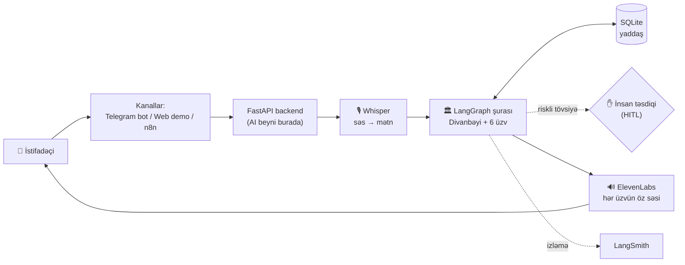
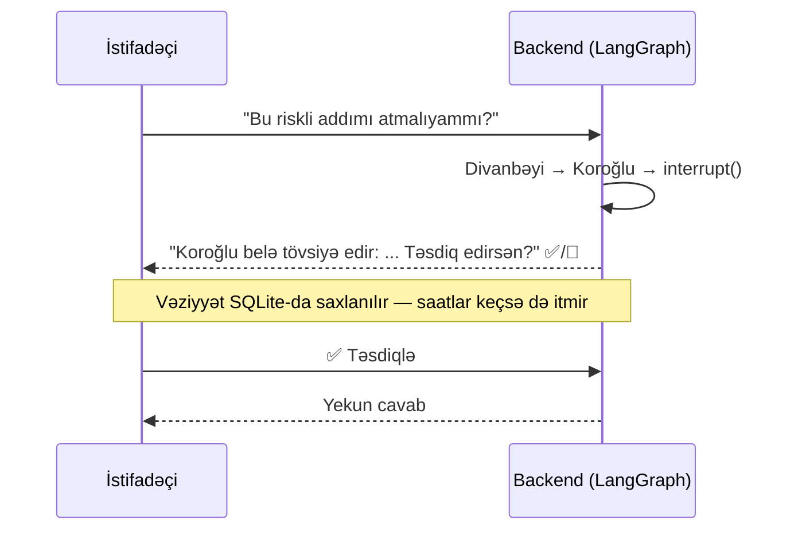

# Divan — Əfsanələr Şurası

> Səslə soruş, Azərbaycan tarixinin altı əfsanəvi simasından — hər biri öz səsi ilə — cavab al.

Dərsdə keçilən AI mühəndisliyi texnologiyalarının hamısını **bir işlək məhsulda** birləşdirən layihə:
istifadəçi mətn və ya səsli mesaj göndərir, **Divanbəyi** (supervisor agent) sualı ən uyğun
üzv(lər)ə yönləndirir, riskli tövsiyələrdə isə insan təsdiqi gözlənilir.

| 🔗 Canlı | Ünvan |
|---|---|
| Demo səhifəsi (HTTPS — mikrofon işləyir) | https://207-154-231-255.sslip.io/demo |
| Demo səhifəsi (HTTP) | http://207.154.231.255/demo |
| API sənədləri (Swagger) | https://207-154-231-255.sslip.io/docs |
| Telegram bot | serverdə 24/7 işləyir |

## Arxitektura — bir baxışda



**Əsas qərar:** bütün AI məntiqi (model, yaddaş, marşrutlaşdırma, HITL, səs) bir yerdə —
FastAPI backend-də. Kanallar (Telegram, web, n8n) yalnız eyni API-ni çağıran adapterlərdir.

## Dərs mövzuları layihədə harada tətbiq olunub?

| Dərs mövzusu | Alət | Necə istifadə olunub | Kod |
|---|---|---|---|
| **Multi-agent (LangGraph)** | `Command(goto=...)`, dövrü qraf | Supervisor sualı 6 üzvdən ən uyğun 1-2-nə yönləndirir, sonra fikirlər sintez olunur | [`builder.py`](apps/voice-ai-agent/app/graph/builder.py) |
| **Human-in-the-Loop** | `interrupt()` / `Command(resume=...)` | Koroğlu (risk personajı) danışanda cavab dayanır, insan Təsdiqlə/İmtina deyənə qədər gözləyir | [`builder.py`](apps/voice-ai-agent/app/graph/builder.py) |
| **Memory** | SQLite checkpoint saver | Hər `thread_id` üzrə söhbət tarixçəsi + paused HITL vəziyyəti serverdə saxlanılır | [`sqlite.py`](apps/voice-ai-agent/app/memory/sqlite.py) |
| **LLM** | OpenAI `gpt-4.1-mini` (Groq alternativi) | Supervisor qərarı + hər üzvün öz xarakter promptu ilə cavabı | [`llm.py`](apps/voice-ai-agent/app/services/llm.py) |
| **Voice AI — STT** | OpenAI Whisper | Telegram/web-dən gələn səsi mətnə çevirir | [`voice.py`](apps/voice-ai-agent/app/services/voice.py) |
| **Voice AI — TTS** | ElevenLabs (üzv başına ayrı səs) | Hər danışan üzvün cavabı öz səsi ilə ayrıca audio seqment kimi qayıdır | [`voice.py`](apps/voice-ai-agent/app/services/voice.py) |
| **Tracing** | LangSmith | Hər model və qraf icrası kanal/model/versiya metadata-sı ilə izlənilir | [`config.py`](apps/voice-ai-agent/app/core/config.py) |
| **Evaluation** | Oflayn "golden" suite (7 case) | Routing, HITL, cavab formatı hər push-da CI-də yoxlanılır | [`evals/`](apps/voice-ai-agent/app/evals/) |
| **Feedback loop** | 👍/👎/düzəliş → SQLite | Hər cavabın `turn_id`-si üzrə rəy toplanır; düzəliş mətni ən güclü siqnaldır | [`feedback.py`](apps/voice-ai-agent/app/memory/feedback.py) |
| **Səs Məktəbi (Voice Lab)** | Canlı öyrənmə dövrü: Telegram `/ses` + web tab | İstifadəçi cümləni oxuyur → sistem onun oxunuşu ilə klonun oxunuşunu Whisper-lə söz-söz tutuşdurur; yazılar klon materialına, xətalar tələffüz lüğətinə yığılır | [`voicelab.py`](apps/voice-ai-agent/app/api/voicelab.py) |
| **Observability (frontend)** | `?v=` keş-möhürü + `/client-log` | Brauzer xətaları anında server loguna düşür; köhnə keşlənmiş JS sinfi səhvlər mümkünsüzdür | [`main.py`](apps/voice-ai-agent/app/main.py) |
| **API** | FastAPI | `/chat`, `/voice`, `/chat/resume`, `/voice/resume`, `/feedback`, `/demo` | [`main.py`](apps/voice-ai-agent/app/main.py) |
| **Avtomatlaşdırma** | n8n (lokal profil) | Eyni API-yə qoşulan vizual workflow adapterləri — 3 hazır workflow | [`n8n/`](n8n/) |
| **Deployment** | Docker Compose + DigitalOcean | `api` + `telegram-bot` konteynerləri canlı serverdə | [`docker-compose.yml`](docker-compose.yml), [`DEPLOY.md`](DEPLOY.md) |
| **Guardrails** (əlavə) | Deterministik təhlükəsizlik qapısı | Kritik risk mesajlarında şura ümumiyyətlə çağırılmır — xarakterdən kənar insani cavab | [`guardrails.py`](apps/voice-ai-agent/app/graph/guardrails.py) |

## Şuranın 6 üzvü

| Üzv | Sahəsi | Danışdığı mətn (RAG korpusu) |
|---|---|---|
| **Molla Nəsrəddin** | gündəlik problemlər, yumor, fərqli baxış | xalq lətifələri |
| **Koroğlu** | cəsarət, risk, haqsızlığa qarşı çıxmaq *(HITL tetikleyicisi)* | Koroğlu dastanı — 5 qol |
| **Simurğ** | dərin həyat sualları, müdriklik | Məlikməmməd nağılı (Zümrüd quşu), quşlar qəsidəsi |
| **Nəsimi** | özünəinam, mənəvi kimlik | «Sığmazam» və digər qəzəllər, rübailər |
| **Dədə Qorqud** | ailə, nəsihət, böyük keçidlər | Kitabi-Dədə Qorqud — 4 boy |
| **Nizami Gəncəvi** | sevgi, münasibətlər, ədalət | Sirlər Xəzinəsi, Leyli və Məcnun, Xosrov və Şirin |

Hər üzvün xarakter promptu real tarixi/ədəbi mənbəyə əsaslanır:
[`divan.py`](apps/voice-ai-agent/app/prompts/divan.py). Hər üzvə ElevenLabs-da ayrı səs təyin olunub.

### Personajların cavabları necə formalaşır?

> **Cavab = Bilik × Xarakter × Qaydalar**

| Komponent | Haradan gəlir |
|---|---|
| **Bilik** | LLM-in təlim bilikləri — model dastanları, «Xəmsə»ni, tarixi artıq «oxuyub». Ayrıca bilik bazası (RAG) yoxdur |
| **Xarakter** | Hər üzv üçün əl ilə yazılmış system prompt: kim olduğu, necə düşündüyü, necə danışdığı — [`divan.py`](apps/voice-ai-agent/app/prompts/divan.py) |
| **Qaydalar** | Yalnız öz sahəsi, başqa üzvün roluna qarışmaq olmaz, ən çox 2 cümlə, istifadəçinin dilində |

Nümunə — Molla Nəsrəddinin promptundan: *«Ciddi sualı çox vaxt qısa, gözlənilməz
bir lətifə və ya paradoksla cavablandır, sonra dərsi bir cümlə ilə çıxar.»*
Ona görə Nəsrəddinin cavabı həmişə lətifə strukturundadır, Dədə Qorqud isə
sözünü alqış və ya el məsəli ilə bitirir.

*Niyə RAG yoxdur?* Qəsdən — dərsin fokusu multi-agent marşrutlaşdırma və
HITL idi. Növbəti addım: hər üzvün real mətnlərindən RAG bazası qurub
cavabları sitatlarla əsaslandırmaq.

## HITL axını — nümunə



Telegram-da bu, real düymələr kimi görünür ([`bot.py`](apps/voice-ai-agent/bot.py)),
web demo-da isə eyni axın brauzerdədir.

## İşə salmaq

**Canlı:** artıq deploy olunub — http://207.154.231.255/demo (detallar: [`DEPLOY.md`](DEPLOY.md)).

**Lokal:**

```bash
cp .env.example .env            # açarları doldur
docker compose --profile telegram up --build    # API (8000) + Telegram bot
docker compose --profile n8n up --build         # + n8n editoru (5678)
```

- API + demo: http://127.0.0.1:8000/demo
- n8n editoru: http://127.0.0.1:5678

**Testlər:**

```bash
cd apps/voice-ai-agent
uv sync
uv run pytest -q                # unit + graph testləri
uv run python -m app.evals.run  # oflayn golden eval (LLM çağırışsız)
```

## Yol xəritəsi — Divan 2.0

Layihənin hədəfi: **Azərbaycan ədəbi irsinə əsaslanan, öz dilində native danışan,
sitatla sübut gətirən ilk çoxagentli AI şurası.** Dünyada persona-chatbot çoxdur;
real milli korpusa "grounded" olan, hər iddiasına mənbədən sitat göstərən şura yoxdur —
fərqimiz budur.

| Faza | İş | Texnologiya | Status |
|---|---|---|---|
| 1 | **Native Azərbaycan səsi** | `eleven_v3` + Voice Design ilə hər üzvə fərqli, obrazına uyğun səs (6/6) + native dastançı klonu + Səs Məktəbi öyrənmə dövrü + avtomatik tələffüz-düzəltmə boru xətti | ✅ 6/6 üzv fərqli səslə danışır |
| 2 | **Grounded personalar (RAG)** | Hər üzvün öz korpusu (Vikimənbə) → embedding retrieval + uyğunluq qapısı; cavablar real bənd/boy sitatı ilə (`citations`) | ✅ **6/6 üzv, 392 parça** — hər üzv öz mətnindən danışır |
| 3 | **Öyrənən yaddaş** | Reflection qrafı: hər sessiyanın kəşfləri LangGraph node-u ilə çıxarılıb bilik bazasına ([`docs/knowledge/`](docs/knowledge/) → vektor store) yazılır və sonrakı cavablarda geri çağırılır — sistem öz təcrübəsindən nəticə çıxarır | planda |
| 3.5 | **Eval intizamı** | Mövcud golden suite üstünə: LLM-as-judge gecə regressiyaları + sitat sədaqəti (groundedness) yoxlamaları | planda |
| 4 | **Production quruluşu** | Postgres checkpoint, auth, feedback dashboard, GitHub Actions auto-deploy | planda |
| 5 | **Danışan portretlər** | Öz native səsimizi qəbul edən avatar qatı: Simli tipli speech-to-video (real-time üçün Tavus / HeyGen LiveAvatar) — dodaq sinxronu ilə canlı sima | vizyon |
| 6 | **Üslub dərinliyi** | Few-shot + RAG → sonra ədəbi korpusla SFT/LoRA (personajın öz üslubunda şeir) | vizyon |
| 7 | **«Zəngin» SaaS** | Multi-tenant platforma, muzey kiosk rejimi — «tarixi şəxsiyyətlərlə söhbət» interaktiv ekranları | vizyon |

**Son hədəf — «Zəngin», virtual keçmişə səyahət:** klassik Azərbaycan ədəbiyyatı və
tarixi şəxsiyyətlər canlı sima ilə — native səs, dodaq sinxronu, hərəkətli portret,
real-vaxt söhbət. Muzeylər və təhsil üçün production-ready SaaS. Açar memarlıq
qərarı: avatar qatı **bizim öz audio axınımızı** qəbul etməlidir (Simli tipli API) —
çünki native Azərbaycan səsi bizim fərqimizdir, platformanın öz TTS-inə güvənmək
onu itirmək deməkdir.

Faza 2-nin qraf dizaynı LangGraph-ın rəsmi agentic-RAG nümunəsinə əsaslanır
(retrieval tool → relevance grading → rewrite loop) və mövcud supervisor qrafına
alt-qraf kimi qoşulacaq — hər üzv öz kitabxanasından oxuyacaq.

## Ətraflı sənədlər

| Sənəd | Nə üçün |
|---|---|
| [`DEPLOY.md`](DEPLOY.md) | Canlı server, giriş, deploy addımları |
| [`n8n/README.md`](n8n/README.md) | n8n workflow-ları və HITL-in n8n-də qurulması |
| [`apps/voice-ai-agent/`](apps/voice-ai-agent/) | Bütün backend kodu (API, qraf, səs, yaddaş, testlər) |
